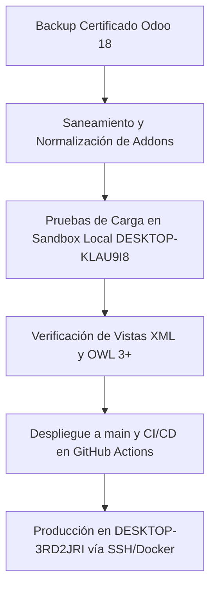

# Chefalitas: Plan de Migración a Odoo 20 y Control Universal DTO con ORCA

## 1. Visión y Alcance
Este documento establece la arquitectura y la hoja de ruta para la migración de la plataforma **Chefalitas** a **Odoo 20**, dotando al motor autónomo **ORCA** de control absoluto sobre los Data Transfer Objects (DTOs) de Odoo a través del protocolo **MCP (Model Context Protocol)** y chat interactivo.

### Módulos Base en esta Etapa:
- **`account`**: Contabilidad, facturas de clientes, notas de crédito, saldos e impuestos.
- **Localización Dominicana (`l10n_do_accounting`)**: Comprobantes Fiscales Electrónicos (e-NCF DGII: B01, B02, E31, E32, etc.), secuencias y reportes fiscales 606/607/608.
- **`point_of_sale` (POS)**: Sesiones activas, órdenes de venta en tiempo real, líneas de producto, métodos de pago y clientes.
- **`stock`**: Existencias disponibles, control de inventario por almacén/ubicación y seguimiento de insumos.
- **`pos_kitchen_core`**: Monitoreo de comandas en preparación, despachadas y tiempos de cocción.
- **`pos_printing_suite`**: Impresión de comandas y recibos fiscales vía hardware local y WebSocket/HTTP.

---

## 2. Arquitectura ORCA Bridge & Servidor MCP

### 2.1 Módulo Odoo: `orca_bridge`
- **Ubicación:** `addons/orca_bridge/`
- **Autenticación:** Cabecera HTTP `Authorization: Bearer <ORCA_API_TOKEN>`, validada contra el parámetro de sistema `orca.api_token` en `ir.config_parameter`.
- **Serializadores DTO:**
  - `account.move.to_orca_dto()`: Transforma facturas Odoo en objetos normalizados con desglose de ítems, totales e información e-NCF (`l10n_do_fiscal_number`).
  - `pos.order.to_orca_dto()`: Estructura órdenes de punto de venta con detalle de productos, mesa/recibo y pagos.
  - `product.product.to_orca_stock_dto()`: Normaliza disponibilidad, inventario a la mano (`qty_available`) y precios de venta.

### 2.2 Endpoints REST Expuestos
| Ruta | Método | Descripción |
|---|---|---|
| `/api/orca/v1/health` | GET | Estado del puente, versión de Odoo y conexión a DB |
| `/api/orca/v1/account/summary` | GET | Resumen financiero (facturado, borrador, total facturas) |
| `/api/orca/v1/account/invoices` | GET / POST | Listado con filtros fiscales y creación de facturas |
| `/api/orca/v1/pos/status` | GET | Estado de cajas y sesiones POS activas |
| `/api/orca/v1/pos/orders` | GET | Historial y pedidos activos de POS |
| `/api/orca/v1/stock/levels` | GET | Existencias de catálogo de productos |
| `/api/orca/v1/kitchen/orders` | GET | Comandas de cocina activas y órdenes en preparación |

### 2.3 Servidor MCP de ORCA
- **Ubicación:** `services/orca/src/modules/odoo_mcp/`
- **Herramientas Disponibles:**
  - `odoo_get_financial_summary`: Consulta saldos y facturación global.
  - `odoo_list_invoices`: Lista facturas con filtros por cliente, e-NCF y estado.
  - `odoo_create_customer_invoice`: Crea borradores de factura con líneas de servicio/producto.
  - `odoo_get_pos_status`: Consulta el estado de las terminales de venta.
  - `odoo_list_pos_orders`: Lista ventas del restaurante/tienda en tiempo real.
  - `odoo_check_stock_availability`: Consulta existencias críticas de insumos y alitas.
  - `odoo_get_kitchen_orders`: Monitorea pedidos enviados a cocina.

---

## 3. Hoja de Ruta de Migración a Odoo 20



### 3.1 Artefactos de Backup Certificados
Los respaldos se encuentran certificados y almacenados en:
`C:\Users\yoeli\Documents\chefalitas_backups\migration_odoo20_20261005_171346`
- **Base de Datos:**
  - `chefalitas_pg16_custom.dump` (PostgreSQL Custom format, 30.59 MB, 19,046 entradas de TOC verificadas)
  - `dump.sql` / `chefalitas_plain_sql.sql.gz` (SQL plano comprimido)
  - `chefalitas_standard_odoo_backup.zip` (Formato estándar Web UI Odoo)
- **Archivos Binarios (Filestore):**
  - `chefalitas_filestore.tar.gz` (32.14 MB, saneado con 0 archivos huérfanos)
- **Código y Configuración:**
  - `chefalitas_addons_and_config.tar.gz` (84.16 MB)
- **Integridad:**
  - `CHECKSUMS_SHA256.txt` y `MIGRATION_MANIFEST.json`

### 3.2 Adaptaciones Técnicas para Odoo 20
1. **Frontend / OWL:** Adaptación de componentes del POS a la especificación OWL 3.x utilizada en Odoo 20 (sin alterar los hooks de impresión de `pos_printing_suite`).
2. **e-NCF DGII:** Validar la compatibilidad de secuencias y certificados de firma digital XML en los nuevos endpoints de facturación electrónica.
3. **ORM & Decorators:** Migrar cualquier `@api.depends` con referencias anidadas obsoletas.

---

## 4. Pipeline de Despliegue a `DESKTOP-3RD2JRI`

- **Gatillo:** Push o Merge a la rama `main` de `JoelStalin/Chefalitas`.
- **Workflow:** `.github/workflows/deploy.yml`
- **Mecanismo:**
  1. Detecta cambios en `addons/` y `restart.sh`.
  2. Transfiere el código mediante SCP seguro al host `PROD_SSH_HOST` (`DESKTOP-3RD2JRI`).
  3. Ejecuta `restart.sh` que compila el contenedor e invoca:
     ```bash
     odoo -u orca_bridge,l10n_do_accounting,pos_system,pos_kitchen_core -d chefalitas --stop-after-init
     ```
  4. Reinicia el contenedor de Odoo y valida que los servicios vuelvan a responder en `https://chefalitas.com.do`.
